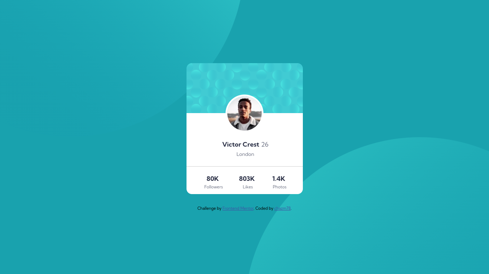

# Frontend Mentor - Profile Card Component Solution

This is a solution to the [Profile card component challenge on Frontend Mentor](https://www.frontendmentor.io/challenges/profile-card-component-cfArpWshJ). Frontend Mentor challenges help you improve your coding skills by building realistic projects.

## Table of contents

- [Overview](#overview)
  - [The challenge](#the-challenge)
  - [Screenshot](#screenshot)
  - [Links](#links)
- [My process](#my-process)
  - [Built with](#built-with)
  - [What I learned](#what-i-learned)
  - [Continued development](#continued-development)
  - [Useful resources](#useful-resources)
- [Author](#author)

## Overview

### The challenge

- Build out the project to the designs provided

### Screenshot

### Links

- Solution URL: [github](https://github.com/chazm78/profile-card)
- Live Site URL: [vercel](https://profile-card-chi-tawny.vercel.app/
## My process

### Built with

- Semantic HTML5 markup
- CSS custom properties
- Flexbox
- Mobile-first workflow

### What I learned

I focused a lot more on Flexbox and how to get things positioned to look right. I still fell like my CSS is a little messy. I am trying to figure out a solid process.

### Continued development

I still have a ton to learn with CSS, but I feel like this is a never-ending process.

### Useful resources

The Internet

## Author

- Frontend Mentor - [@chazm78](https://www.frontendmentor.io/profile/chazm78)
- Github - [@chazm78](https://github.com/chazm78)
